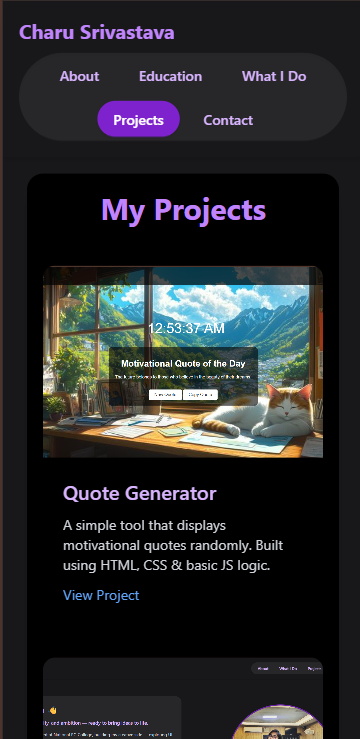

# 🌐 Charu Srivastava - Personal Portfolio Website

This is my **personal portfolio website**, designed and developed by me to showcase my **projects, skills**, and **creative side**. It reflects my passion for building clean, interactive, and responsive user interfaces using simple yet powerful web technologies.

---

## ✨ My Experience Building This

Building this website has been a valuable hands-on learning journey. Here's what I explored and achieved:

---

### 🔧 Learning Tailwind CSS from Scratch

This was my **first real project using Tailwind CSS**. I explored:

- Using utility-first classes effectively
- Structuring responsive layouts using **Flexbox** and **Grid**
- Creating hover effects, shadows, transitions, and animations

---

### 🎨 UI/UX Decisions

- Chose a **dark theme** with subtle colored highlights (like **metallic purple**)
- Used **SVG icons** for clean, scalable social links with hover transitions
- Designed the **"What I Do"**, **"About Me"**, and **"Projects"** sections using Tailwind’s utilities (box-shadow, padding, scale) for a modern layout

---

### 📱 Mobile Responsiveness

One of my top goals was **mobile-first design**. I tested layout and responsiveness for:

- Mobile, tablet, and desktop devices
- Proper spacing and alignment
- Smooth hover transitions on touchscreens

---

### 🧠 Problem Solving

During development, I faced and solved challenges like:

- Centering items inside flex containers
- Balancing spacing between sections
- Making buttons/icons pop while staying readable

Solving these helped me **understand front-end styling deeply** and boosted my confidence.

---

## 🔗 Live Preview

🌍 **Visit My Portfolio:** [charu4-io.github.io/portfolio](https://charu4-io.github.io/portfolio/)

---

## 🛠 Tech Stack

- HTML5  
- Tailwind CSS  
- SVG Icons  
- Hosted on **GitHub Pages**

---

## 📸 Screenshots

### 💻 Full Desktop View

### 📱 Mobile View

---

## 👩‍💻 Built with Love by Charu Srivastava

Made with Tailwind, curiosity, and 💜
